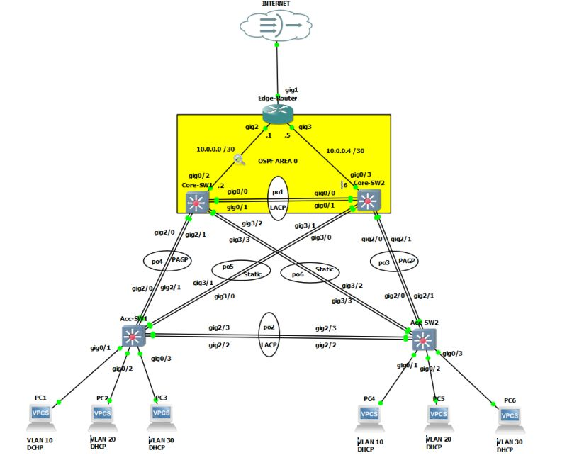
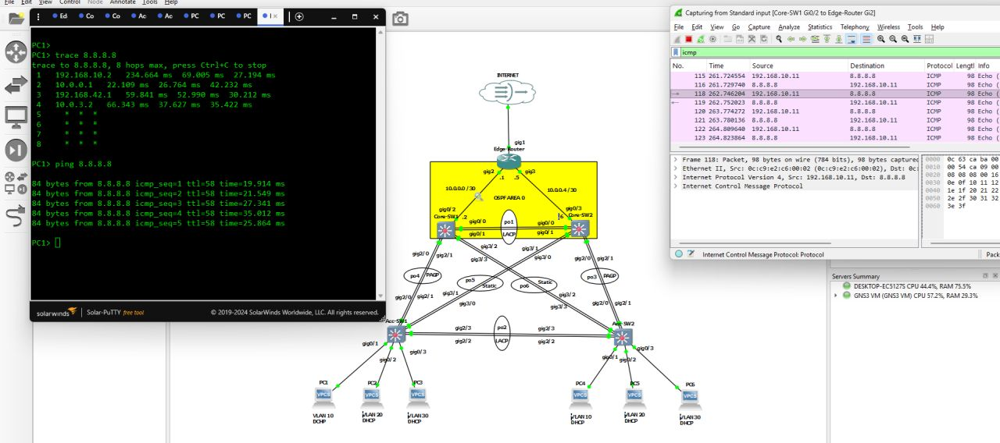
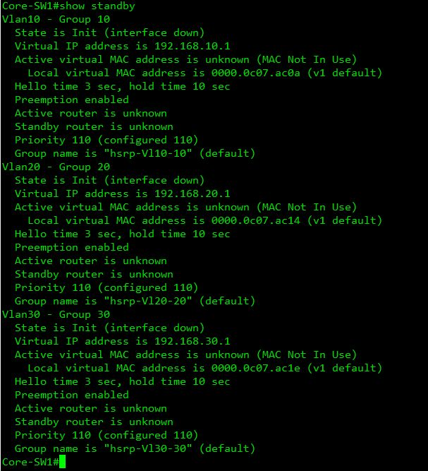
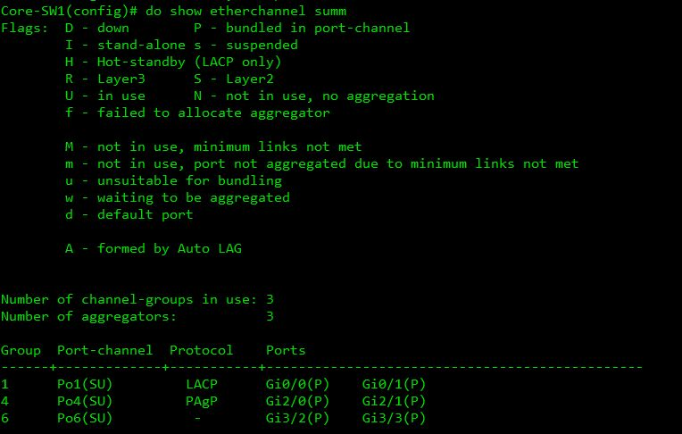

# 🚀 High-Availability Collapsed Core Architecture: OSPF Campus LAN and NAT Edge Integration

## 📌 Project Overview
This standalone repository showcases the deployment and verification of a production-ready, high-availability (HA) enterprise campus network fabric fully emulated inside **GNS3**. Utilizing a resilient **Collapsed Core design**, this architecture completely eliminates single points of failure across the Layer 2/Layer 3 boundaries. 

The implementation features an optimized layout combining First-Hop Redundancy Protocols (**HSRP**), structured loop-prevention primitives via Per-VLAN Spanning Tree optimization, link aggregation, **OSPFv2 dynamic routing**, and dynamic **NAT/PAT overload edge translation** perimeters to preserve public IP space while guaranteeing seamless link failover states.

---

## 🗺️ Network Topology & Design Layout

The system topology maps out dual-homed interconnectivity corridors across access-to-core infrastructure divisions, creating deterministic link pathways and automated state switchings.

---

## 🛠️ Technical Stack & Deep Configuration Mechanics

### 1. Layer 2 Resiliency & Gateway Redundancy
* **Collapsed Core Architecture:** Merged traditional core and distribution layers into redundant multi-layer nodes, scaling down hardware complexity while introducing architectural transport elasticity.
* **Hot Standby Router Protocol (HSRP):** Configured active/standby gateway redundancy topologies (`standby ip [Virtual-GW-IP]`) to provide seamless default-hop protection for local access VLAN hosts during physical link failures.
* **Deterministic Spanning Tree Control:** Controlled root election states by manually assigning primary and secondary root bridges (`spanning-tree vlan [ID] root primary`) to align physical data streams with logical traffic engineering boundaries.
* **Multi-Protocol Link Aggregation:** Combined physical connections into high-speed trunk bundles utilizing open-standard Link Aggregation Control Protocol (LACP), Cisco Port Aggregation Protocol (PAgP), and forced static bundling states to maximize switchboard throughput.

### 2. Layer 3 Routing & Network Services
* **Single-Area OSPFv2 Framework:** Instantiated open-standard link-state tracking natively inside Area 0, ensuring rapid sub-second path convergence and protocol database normalization across all internal routing segments.
* **Default Route Propagation:** Configured default-information origination parameters at the edge perimeters to dynamically seed Gateways of Last Resort out to all downward core nodes.
* **Centralized Network Address Services:** Built and isolated automated IPv4 allocation pools directly under multi-layer interfaces, configuring strict excluded boundaries to shield critical core network objects from allocation overlap errors.

### 3. Edge Translation Perimeter & Security
* **NAT Overload / PAT Fabric:** Implemented secure perimeter mapping using Port Address Translation (PAT) on the outside WAN boundary interfaces, securely tracking multi-user outbound traffic through unique Layer 4 port multiplexes.
* **Traffic Identification Access Lists (ACLs):** Designed and bound extended named access lists to intercept, classify, and isolate private RFC 1918 internal subnets prior to dynamic global boundary translations.

---

## 📊 Verification, Validation & Diagnostics

Comprehensive data plane stress testing, loop-prevention state checks, and active failover audits were carried out to confirm structural system-wide uptime stability:

### 🔹 Core Runtime Matrix Verification
Auditing the active software engine processes, system variables, and interface health states via live Cisco CLI monitoring panels.

### 🔹 First-Hop Redundancy Validation (HSRP Status)
Inspecting the runtime virtual IP state engine, tracking parameters, priority weights, and preemption triggers to ensure proper active/standby gateway synchronization.

### 🔹 EtherChannel Aggregation & Bundling Health
Analyzing logical group definitions, port channel statuses, and active interface flag allocations to confirm error-free cross-link grouping parameters.

---
## 👥 Author Profile

* **Network Engineer:** John Ivan P. Ello
* **Professional Credentials:** Summa Cum Laude Graduate, BS in Information Systems | CCNA Certified
* **Email:** [1ello.johnivan03@gmail.com](mailto:1ello.johnivan03@gmail.com)
* **LinkedIn:** [linkedin.com/in/johnivanello](https://www.linkedin.com/in/johnivanello/)
* **GitHub Portfolio:** [github.com/JohnIvan-Ello](https://github.com/JohnIvan-Ello)
